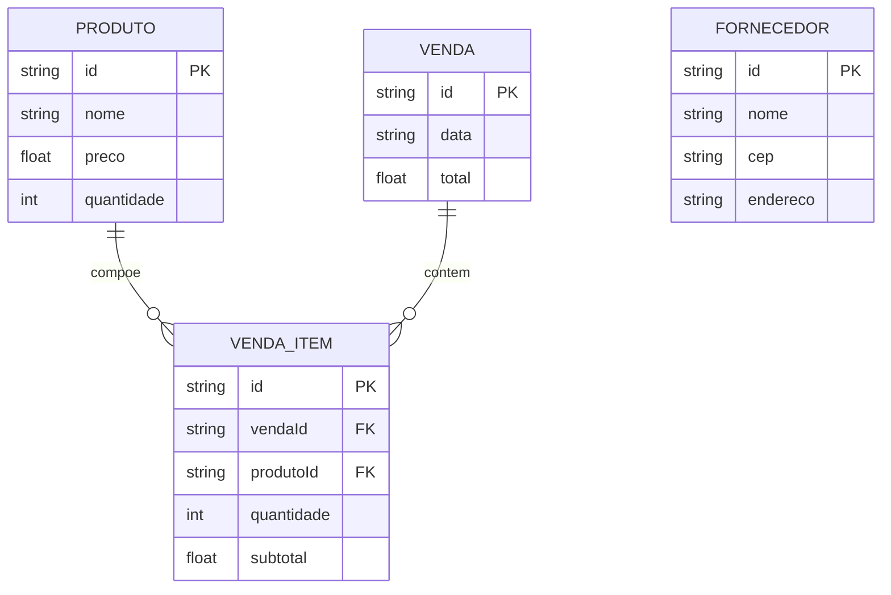

# 🛠️ Especificação Técnica (Tech Spec) - Sistema de Recursos Empresariais

Este documento descreve a arquitetura técnica, o modelo de dados e os contratos de API (via JSON Server) da aplicação, que tem como objetivo gerenciar recursos empresariais como produtos, vendas e fornecedores.

---

## 1. Modelo de Dados (Diagrama ER)



---

## 2. Dicionário de Dados

- Produtos: Armazena os itens disponíveis no estoque.
- Vendas: Representa uma venda realizada.
- Itens da Venda: Relaciona produtos com vendas.
- Fornecedores: Armazena dados dos fornecedores.

---

## 3. Regras de Negócio Técnicas

- Verificar estoque antes da venda
- Atualizar quantidade automaticamente
- Calcular total automaticamente
- Impedir venda sem estoque

---

## 4. Rotas da API (JSON Server)

- GET /produtos
- POST /produtos
- PUT /produtos/:id
- DELETE /produtos/:id

- GET /vendas
- POST /vendas

- GET /venda_itens
- POST /venda_itens

- GET /fornecedores
- POST /fornecedores

---

## 5. Estrutura do Banco de Dados (db.json)

```json
{
  "produtos": [
    {
      "id": "1",
      "nome": "Notebook",
      "preco": 3500.00,
      "quantidade": 10
    }
  ],
  "vendas": [
    {
      "id": "1",
      "data": "2026-03-30",
      "total": 3500.00
    }
  ],
  "venda_itens": [
    {
      "id": "1",
      "vendaId": "1",
      "produtoId": "1",
      "quantidade": 1,
      "subtotal": 3500.00
    }
  ],
  "fornecedores": [
    {
      "id": "1",
      "nome": "Fornecedor Exemplo",
      "cep": "85000000",
      "endereco": "Rua Exemplo, PR"
    }
  ]
}
```