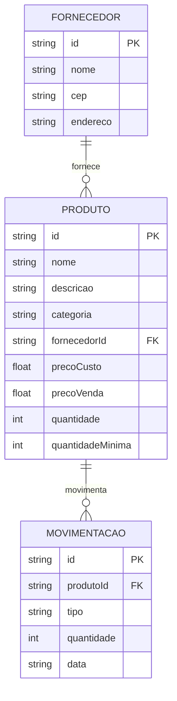

# Especificação Técnica (Tech Spec) - Sistema de Recursos Empresariais

Este documento descreve a arquitetura técnica, o modelo de dados e os contratos de API da aplicação, que tem como objetivo gerenciar recursos empresariais como produtos, estoque, fornecedores e movimentações de entrada e saída.

---

# 1. Modelo de Dados (Diagrama ER)



---

# 2. Dicionário de Dados

## Produtos

Campo: id  
Tipo: string  
Descrição: Identificador único do produto

Campo: nome  
Tipo: string  
Descrição: Nome do produto

Campo: descricao  
Tipo: string  
Descrição: Descrição detalhada do produto

Campo: categoria  
Tipo: string  
Descrição: Categoria do produto

Campo: fornecedorId  
Tipo: string  
Descrição: Referência ao fornecedor

Campo: precoCusto  
Tipo: float  
Descrição: Valor de custo do produto

Campo: precoVenda  
Tipo: float  
Descrição: Valor de venda do produto

Campo: quantidade  
Tipo: int  
Descrição: Quantidade disponível em estoque

Campo: quantidadeMinima  
Tipo: int  
Descrição: Quantidade mínima recomendada

---

## Fornecedores

Campo: id  
Tipo: string  
Descrição: Identificador único

Campo: nome  
Tipo: string  
Descrição: Nome do fornecedor

Campo: cep  
Tipo: string  
Descrição: CEP do fornecedor

Campo: endereco  
Tipo: string  
Descrição: Endereço do fornecedor

---

## Movimentações

Campo: id  
Tipo: string  
Descrição: Identificador único da movimentação

Campo: produtoId  
Tipo: string  
Descrição: Referência ao produto movimentado

Campo: tipo  
Tipo: string  
Descrição: Tipo da movimentação (entrada ou saida)

Campo: quantidade  
Tipo: int  
Descrição: Quantidade movimentada

Campo: data  
Tipo: string  
Descrição: Data da movimentação

---

# 3. Regras de Negócio Técnicas

## Controle de Estoque

- Verificar estoque antes da saída
- Impedir saída sem estoque suficiente
- Atualizar quantidade automaticamente após movimentação
- Quantidades não podem ser negativas
- Alertar quando estoque atingir quantidade mínima

---

## Controle de Movimentações

- Toda movimentação deve possuir um produto
- Toda movimentação deve possuir quantidade válida
- O tipo da movimentação deve ser:
  - entrada
  - saida

---

## Entrada de Produtos

```txt
estoqueNovo = estoqueAtual + quantidade
```

---

## Saída de Produtos

```txt
estoqueNovo = estoqueAtual - quantidade
```

---

## Controle de Produtos

- Produto deve possuir nome
- Produto deve possuir categoria
- Produto deve possuir fornecedor associado
- Produto deve possuir preço de venda válido

---

# 4. Rotas da API (JSON Server)

## Produtos

```http
GET    /produtos
GET    /produtos/:id
POST   /produtos
PUT    /produtos/:id
DELETE /produtos/:id
```

---

## Movimentações

```http
GET    /movimentacoes
GET    /movimentacoes/:id
POST   /movimentacoes
PUT    /movimentacoes/:id
DELETE /movimentacoes/:id
```

---

## Fornecedores

```http
GET    /fornecedores
GET    /fornecedores/:id
POST   /fornecedores
PUT    /fornecedores/:id
DELETE /fornecedores/:id
```

---

# 5. Estrutura do Banco de Dados (db.json)

```json
{
  "produtos": [
    {
      "id": "1",
      "nome": "Notebook Dell Inspiron 15",
      "descricao": "Notebook com 8GB RAM e SSD 1TB",
      "categoria": "Informática",
      "fornecedorId": "1",
      "precoCusto": 2800.0,
      "precoVenda": 3500.0,
      "quantidade": 10,
      "quantidadeMinima": 2
    }
  ],

  "fornecedores": [
    {
      "id": "1",
      "nome": "Fornecedor Exemplo",
      "cep": "85000000",
      "endereco": "Rua Exemplo, Paraná"
    }
  ],

  "movimentacoes": [
    {
      "id": "1",
      "produtoId": "1",
      "tipo": "saida",
      "quantidade": 2,
      "data": "2026-05-21"
    }
  ]
}
```

---

# 6. Fluxo Técnico da Movimentação

```txt
1. Usuário seleciona o produto
2. Usuário informa a quantidade
3. Usuário escolhe o tipo da movimentação
4. Sistema verifica o estoque
5. Sistema atualiza a quantidade automaticamente
6. Sistema registra a movimentação
```

---

# 7. Tecnologias Utilizadas

```txt
HTML5
CSS3
JavaScript
JSON Server
Fetch API
```

---

# 8. Objetivo do Sistema

O sistema foi desenvolvido com foco no gerenciamento empresarial simplificado, permitindo:

```txt
Controle de estoque
Cadastro de produtos
Controle de fornecedores
Movimentações de entrada
Movimentações de saída
Monitoramento de estoque mínimo
Organização de recursos empresariais
```
